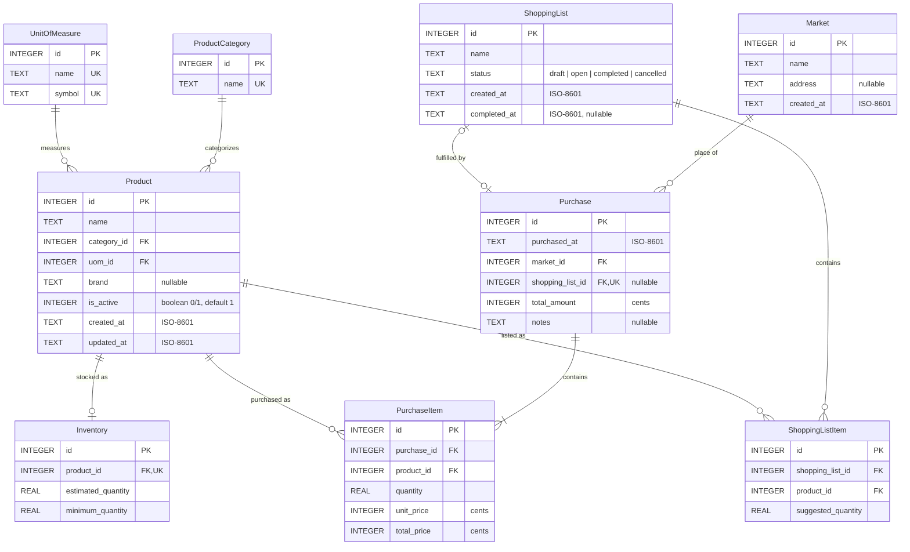

```mermaid
erDiagram
    ProductCategory ||--o{ Product : categorizes
    UnitOfMeasure ||--o{ Product : measures
    Product ||--o| Inventory : "stocked as"
    Market ||--o{ Purchase : "place of"
    ShoppingList |o--o| Purchase : "fulfilled by"
    Purchase ||--|{ PurchaseItem : contains
    Product ||--o{ PurchaseItem : "purchased as"
    ShoppingList ||--o{ ShoppingListItem : contains
    Product ||--o{ ShoppingListItem : "listed as"

    Product {
        INTEGER id PK
        TEXT name
        INTEGER category_id FK
        INTEGER uom_id FK
        TEXT brand "nullable"
        INTEGER is_active "boolean 0/1, default 1"
        TEXT created_at "ISO-8601"
        TEXT updated_at "ISO-8601"
    }

    Purchase {
        INTEGER id PK
        TEXT purchased_at "ISO-8601"
        INTEGER market_id FK
        INTEGER shopping_list_id FK,UK "nullable"
        INTEGER total_amount "cents"
        TEXT notes "nullable"
    }

    PurchaseItem {
        INTEGER id PK
        INTEGER purchase_id FK
        INTEGER product_id FK
        REAL quantity
        INTEGER unit_price "cents"
        INTEGER total_price "cents"
    }

    ShoppingList {
        INTEGER id PK
        TEXT name
        TEXT status "draft | open | completed | cancelled"
        TEXT created_at "ISO-8601"
        TEXT completed_at "ISO-8601, nullable"
    }

    ShoppingListItem {
        INTEGER id PK
        INTEGER shopping_list_id FK
        INTEGER product_id FK
        REAL suggested_quantity
    }

    Market {
        INTEGER id PK
        TEXT name
        TEXT address "nullable"
        TEXT created_at "ISO-8601"
    }

    ProductCategory {
        INTEGER id PK
        TEXT name UK
    }

    Inventory {
        INTEGER id PK
        INTEGER product_id FK,UK
        REAL estimated_quantity
        REAL minimum_quantity
    }

    UnitOfMeasure {
        INTEGER id PK
        TEXT name UK
        TEXT symbol UK
    }
```
